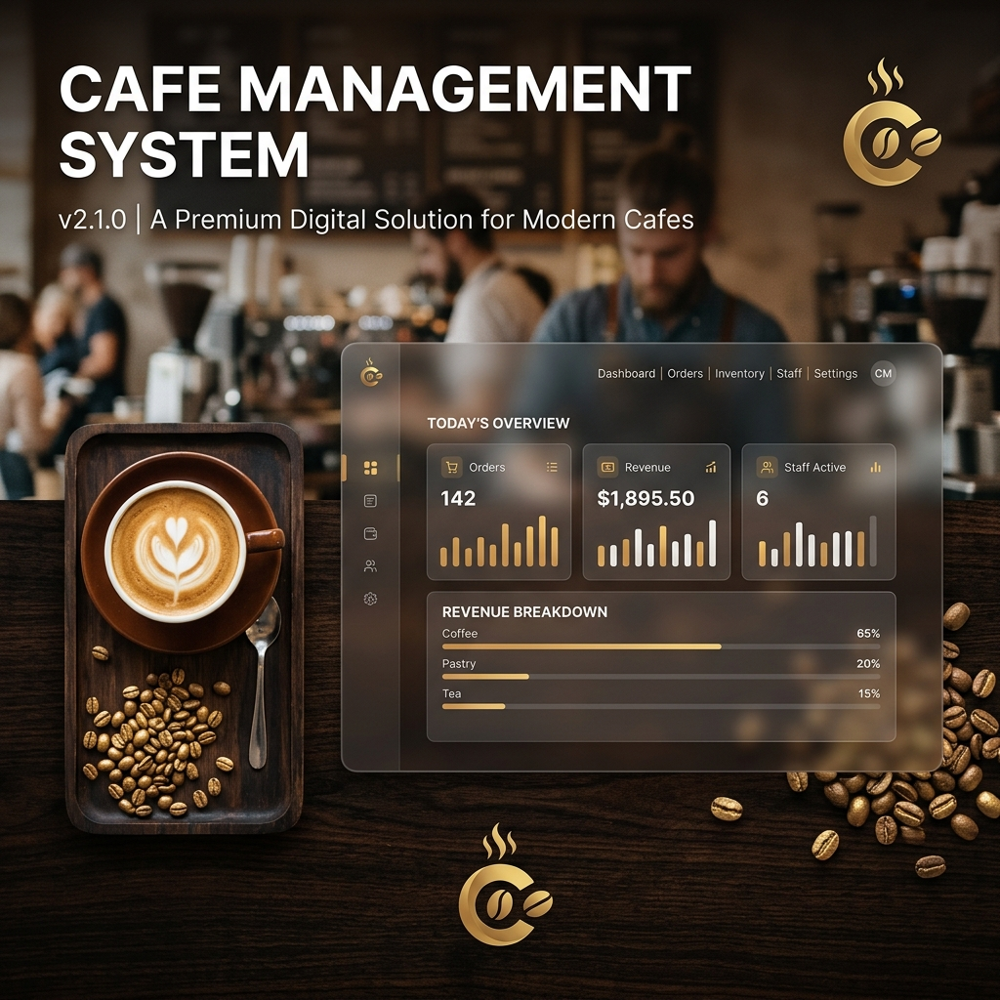

<p align="center">
  
</p>

<h1 align="center">☕ BrewHouse Cafe Management System</h1>
<p align="center"><b>An Enterprise-Grade, High-Performance SaaS Solution for Modern Cafes</b></p>

<p align="center">
  
  
  
  
  
</p>

---

## 📖 Overview

**BrewHouse Cafe** is a sophisticated, full-stack management ecosystem built using **ASP.NET Core 8 MVC**. It is engineered to handle high-traffic cafe operations with a focus on real-time data synchronization, advanced inventory tracking, and a premium user experience. This project demonstrates industry-level architecture, including **Repository Patterns**, **Dependency Injection**, and **TPH (Table Per Hierarchy)** inheritance.

---

## 🚀 Professional-Grade Features

### 🏢 Multi-Outlet & Inventory Control
- **Dynamic Inventory:** Real-time stock tracking with automatic minimum stock alerts.
- **Recipe Management:** Seamless integration between menu items and raw materials.
- **Wastage Logging:** Dedicated module to track and optimize operational efficiency.
- **TPH Architecture:** Clean database design for diverse menu categories (Beverages, Food, Desserts, Snacks).

### 📊 Intelligent Analytics Dashboard
- **Live Metrics:** Track daily revenue, total orders, and top-selling items in real-time.
- **BST Sync:** Precision logging synchronized with **Bangladesh Standard Time (UTC+6)**.
- **Visual Reports:** High-density data cards providing actionable insights at a glance.

### ⚡ Real-Time Operational Flow
- **SignalR Integration:** Instant order notifications for staff and admins without page refreshes.
- **AJAX-Powered Cart:** A seamless customer experience with live badge updates.
- **Interactive UI:** Premium glassmorphic design system using Vanilla CSS and SweetAlert2.

### 🔐 Enterprise Security
- **RBAC (Role-Based Access Control):** Granular permissions for Admins, Staff, and Customers.
- **Security Hardening:** BCrypt hashing, session-based authentication, and Rate Limiting middleware.
- **Data Protection:** Environment-variable-based configuration for sensitive credentials.

---

## 🛠️ Technical Excellence

| Layer | Technology |
| :--- | :--- |
| **Core Framework** | .NET 8.0 MVC |
| **Data Persistence** | Entity Framework Core (SQL Server / In-Memory) |
| **Communication** | SignalR (Real-time WebSockets) |
| **Background Tasks** | Hosted Services for Daily Automated Reporting |
| **Frontend Engine** | Vanilla CSS (Custom Design System) + jQuery |
| **Security** | BCrypt.Net + ASP.NET Identity Concepts |

---

## 📦 Installation & Setup

### Prerequisites
- **SDK:** .NET 8.0 SDK
- **Database:** SQL Server (Express or LocalDB)
- **Tools:** Visual Studio 2022 or VS Code

### Quick Start
1. **Clone & Navigate:**
   ```bash
   git clone https://github.com/ta-syn/BrewHouse-Cafe-.git
   cd BrewHouse-Cafe-
   ```
2. **Environment Configuration:**
   Create a `.env` file in the root directory:
   ```env
   ADMIN_EMAIL=admin@cafe.com
   ADMIN_PASSWORD=your_secure_password
   ```
3. **Database Migration:**
   ```bash
   dotnet ef database update
   ```
4. **Launch Application:**
   ```bash
   dotnet run
   ```
   Access the dashboard at: `http://localhost:5100`

---

## 🛡️ Intellectual Property & Licensing

> [!IMPORTANT]
> **Copyright © 2026 BrewHouse Cafe Management. All rights reserved.**
> 
> This project is a proprietary professional portfolio. Unauthorized copying, modification, or distribution of this codebase is strictly prohibited. If you are using this code for educational purposes or as a reference, please ensure proper attribution is provided.
> 
> **License:** Strictly Private / Proprietary.

---

<p align="center">
  <b>Designed & Developed with ❤️ for Professional Excellence</b>
</p>
